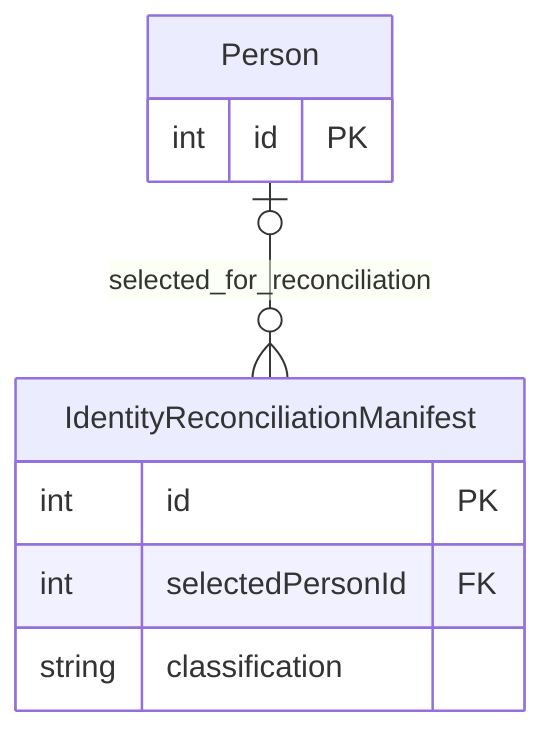

# Consolidated Target Master ERD v1

**Status:** TARGET FROZEN. This is canonical global architecture view for the
consolidated Target Relational Model v1. It is not current Prisma or a
migration specification.

`TARGET_PERSISTENT_ENTITIES=40`
`TRANSITIONAL_ENTITIES=1`
`MASTER_RELATIONSHIPS=61`

```mermaid
erDiagram
    OrganizationProfile {
        int id PK
        string legalIdentification
        string dinadecoRegistrationCode
    }
    Person {
        int id PK
        string normalizedIdentification
    }
    Role {
        int id PK
        string name UK
    }
    Permission {
        int id PK
        string code UK
    }
    RolePermission {
        int roleId PK, FK
        int permissionId PK, FK
    }
    User {
        int id PK
        int personId FK, UK
        int roleId FK
        string email UK
    }
    Session {
        int id PK
        int userId FK
        string refreshTokenHash UK
    }
    AuditLog {
        int id PK
        int userId FK
    }
    PasswordResetToken {
        int id PK
        int userId FK
        string tokenHash UK
    }
    AccountActivationToken {
        int id PK
        int userId FK
        string tokenHash UK
    }
    UserRequest {
        int id PK
        int reviewedById FK
        int personId FK
    }
    Affiliate {
        int id PK
        int personId FK, UK
    }
    AffiliateRequest {
        int id PK
        int reviewedById FK
        int personId FK
    }
    AffiliateSanction {
        int id PK
        int affiliateId FK
        int createdById FK
    }
    GovernancePosition {
        int id PK
        string code UK
    }
    GovernanceTerm {
        int id PK
        string status
    }
    GovernanceMembership {
        int id PK
        int termId FK
        int positionId FK
        int affiliateId FK
        int seatNumber
        int appointedByAssemblyId FK
    }
    Assembly {
        int id PK
    }
    AssemblyCall {
        int id PK
        int assemblyId FK
        int callNumber
    }
    AssemblyConvocation {
        int id PK
        int assemblyId FK
        int affiliateId FK
        int governanceMembershipId FK
    }
    AssemblyAttendance {
        int id PK
        int convocationId FK, UK
    }
    AbsenceJustification {
        int id PK
        int attendanceId FK, UK
        int reviewedById FK
    }
    AssemblyMinute {
        int id PK
        int assemblyId FK, UK
    }
    AssemblyResolution {
        int id PK
        int assemblyId FK
    }
    Event {
        int id PK
        uuid publicId UK
    }
    ReservableResource {
        int id PK
    }
    Reservation {
        int id PK
        int resourceId FK
        int requesterUserId FK
        int approvedById FK
        int eventId FK
    }
    FinancialAccount {
        int id PK
        string code UK
    }
    FinancialCharge {
        int id PK
        int reservationId FK, UK
    }
    Payment {
        int id PK
        int chargeId FK
        int movementId FK, UK
        int recordedById FK
    }
    FinancialMovement {
        int id PK
        int accountId FK
        int recordedById FK
        int reversalOfId FK, UK
        int voidedById FK
    }
    Donation {
        int id PK
        int donorPersonId FK
        int recordedById FK
        int cancelledById FK
        int originalMovementId FK, UK
    }
    Expense {
        int id PK
        int authorizationResolutionId FK
    }
    ExpenseDocument {
        int id PK
        int expenseId FK
    }
    Disbursement {
        int id PK
        int expenseId FK
        int movementId FK, UK
    }
    FundingAllocation {
        int id PK
        int expenseId FK
        int incomeMovementId FK
    }
    InventoryCategory {
        int id PK
        string name UK
    }
    InventoryItem {
        int id PK
        string code UK
        int categoryId FK
    }
    InventoryMovement {
        int id PK
        int itemId FK
        int createdById FK
        int quantityDelta
    }
    InventoryLoan {
        int id PK
        int itemId FK
        int borrowerAffiliateId FK
        int createdById FK
        int receivedById FK
        int cancelledById FK
        int checkoutMovementId FK, UK
        int returnMovementId FK, UK
        int cancellationMovementId FK, UK
    }

    Person o|--|| User : has_access_account
    Role ||--o{ User : authorizes
    Role ||--o{ RolePermission : grants
    Permission ||--o{ RolePermission : assigned_to
    User ||--o{ Session : owns
    User o|--o{ AuditLog : acts_in
    User ||--o{ PasswordResetToken : receives
    User ||--o{ AccountActivationToken : receives
    User o|--o{ UserRequest : reviews
    Person o|--o{ UserRequest : reconciles
    Person o|--|| Affiliate : has_affiliation
    User o|--o{ AffiliateRequest : reviews
    Person o|--o{ AffiliateRequest : reconciles
    Affiliate ||--o{ AffiliateSanction : receives
    User ||--o{ AffiliateSanction : creates
    GovernanceTerm ||--o{ GovernanceMembership : contains
    GovernancePosition ||--o{ GovernanceMembership : defines
    Affiliate ||--o{ GovernanceMembership : holds
    Assembly o|--o{ GovernanceMembership : appoints
    Assembly ||--o{ AssemblyCall : schedules
    Assembly ||--o{ AssemblyConvocation : convenes
    Affiliate ||--o{ AssemblyConvocation : is_invited
    GovernanceMembership o|--o{ AssemblyConvocation : snapshots
    AssemblyConvocation ||--o| AssemblyAttendance : records
    AssemblyAttendance ||--o| AbsenceJustification : supports
    User o|--o{ AbsenceJustification : reviews
    Assembly ||--o| AssemblyMinute : records
    Assembly ||--o{ AssemblyResolution : adopts
    ReservableResource ||--o{ Reservation : is_reserved
    User ||--o{ Reservation : requests
    User o|--o{ Reservation : approves
    Event o|--o{ Reservation : groups
    Reservation ||--o| FinancialCharge : creates
    FinancialCharge ||--o{ Payment : receives
    FinancialMovement ||--o| Payment : evidences
    User o|--o{ Payment : records
    FinancialAccount ||--o{ FinancialMovement : contains
    User ||--o{ FinancialMovement : records
    FinancialMovement o|--o| FinancialMovement : reverses
    User o|--o{ FinancialMovement : voids
    Person o|--o{ Donation : donates
    User ||--o{ Donation : records
    User o|--o{ Donation : cancels
    FinancialMovement ||--o| Donation : is_original_for
    AssemblyResolution o|--o{ Expense : authorizes
    Expense ||--o{ ExpenseDocument : proves
    Expense ||--o{ Disbursement : executes
    FinancialMovement ||--o| Disbursement : evidences
    Expense ||--o{ FundingAllocation : receives
    FinancialMovement o|--o{ FundingAllocation : funds
    InventoryCategory ||--o{ InventoryItem : classifies
    InventoryItem ||--o{ InventoryMovement : changes
    User o|--o{ InventoryMovement : creates
    InventoryItem ||--o{ InventoryLoan : is_loaned
    Affiliate o|--o{ InventoryLoan : borrows
    User o|--o{ InventoryLoan : creates
    User o|--o{ InventoryLoan : receives
    User o|--o{ InventoryLoan : cancels
    InventoryMovement o|--o| InventoryLoan : checkout_evidence
    InventoryMovement o|--o| InventoryLoan : return_evidence
    InventoryMovement o|--o| InventoryLoan : cancellation_evidence
```

## Transitional infrastructure

`IdentityReconciliationManifest` is TRANSITIONAL and not one of the 40.

## Diagram notes

- `GovernanceMembership.seatNumber` is nullable; active-seat uniqueness applies
  only when it is present.
- `AssemblyMinute.assemblyId` is required unique: Assembly `1 -> 0..1`
  AssemblyMinute.
- `FundingAllocation.incomeMovementId` is nullable and non-unique. Aggregate
  availability constraints are documented in the consolidated model/dictionary.
- Mermaid does not encode singleton enforcement, aggregate allocation caps,
  transition gates, or cross-row movement compatibility.

## ADD_STATUS_NOTE: ERD design reference; post-merge implementation note

This Consolidated Master ERD preserves the Target v1 design as historical
architecture reference. The ERD diagram itself is unchanged — it records the
v1 global architecture view (40 persistent + 1 transitional + 61 relationships).

**V1.1 structural implementation:** The merged implementation at main@71aa989
(PR #102) provides the V1.1 structural contract (49 persistent + 1 transitional
+ 77 persistent Target relationships). The ERD design reference remains correct
as v1 architecture; however, the following deferred gates represent evidence-
dependent cutover points that extend the v1 shape:

- `ID-01`: Person canonical mapping + duplicate-data removal
- `ASM-ATT-01`: Complete parent mapping before new attendance/justification FKs
- `FIN-ORIGIN-01`: Explicit-origin reconciliation before generic `sourceId` removal
- `FIN-DON-01`: Donation original/reversal evidence before redundant-field removal
- `INV-LEDGER-01`: Signed ledger enforcement before opening-balance backfill
- `INV-LOAN-01`: Evidence-backed loan-movement links
- `ASM-DATE-01`: Date evidence mapping before `heldAt` backfill/enforcement
- `RES-STATUS-01`: Non-destructive `CONFIRMED`/`COMPLETED` removal

**Package distinction:** This ERD is the v1 design reference (`IMPLEMENTATION_STATUS=frozen historical`). The V1.1 package records the merged implementation separately. Do not treat the v1.1 structural count as an update to this ERD diagram — the diagram remains v1 canonical view, and v1.1 extension is documented additively.

**Do not modify the ERD diagram** to add v1.1 entities or relationships. The v1.1 extension is recorded in the V1.1 evolution matrix and the implementation-status canonical bridge, not by altering the frozen v1 ERD.
